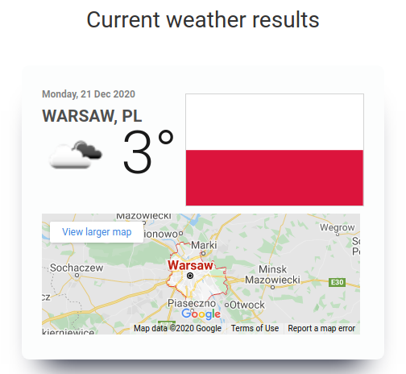

# current_weather

Simple D8 module that fetches weather data from openweathermap.org.

Please access <strong>'/weather'</strong> page to see results or click <strong>'Current weather</strong>' menu item from the main menu.

Optionally you can pass some arguments like city name and two letter country code like this: /weather/[city_name]/[country_code] (e.g. /weather/Tokyo or /weather/Tokyo/JP). City name is more important than the country code.

Example of module output:

